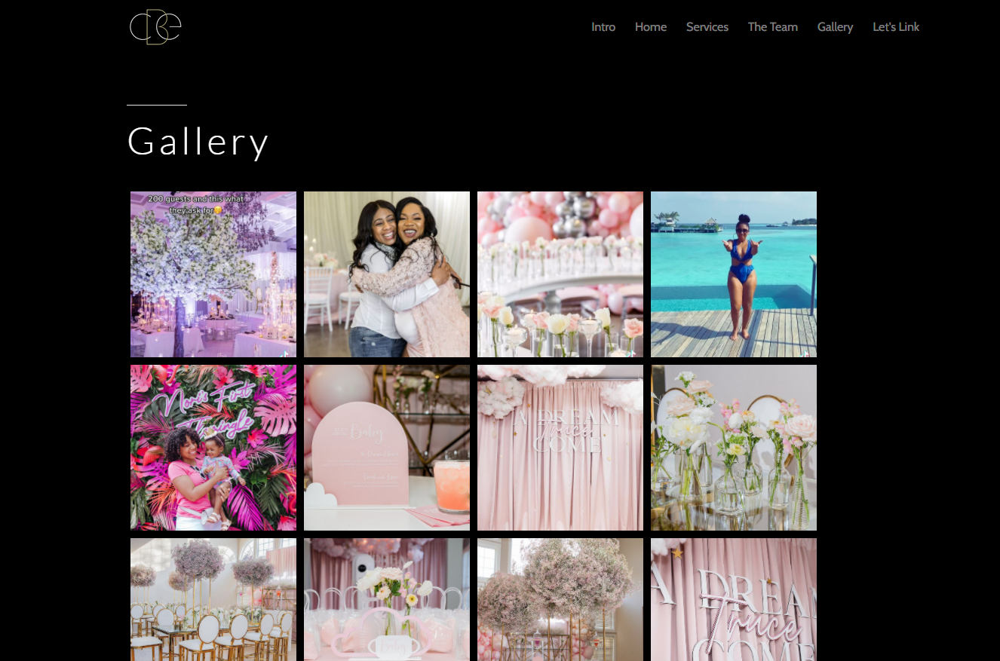

# C'est Belle Events

## Main project goal

The purpose of this application is to provide C'est Belle Events a web presence while being free of maintenance. As an added bonus, this React application will give C'est Belle Events the ability to incorporate industry leading technologies when the time is right.

### Installation

## Instructions to run the application locally:

- Run..

```
npm install
```

- ..then run

```
npm start
```

## Functionality

- The user may navigate through various landing pages.
- The user is returned a selected group of photos upon viewing the gallery page.

## Screenshot



## Roadmap

- Add a an appointment schecduler
- Work with the client to explore new techonlogies

## Credits

- [React](https://reactjs.org/)
- [Axios](https://www.npmjs.com/package/react-axios)
- [Bootstrap](https://react-bootstrap.github.io/)
- [Instafeed](https://www.npmjs.com/package/react-instafeed)
- [React Router](https://reactrouter.com/web/guides/quick-start)

  © 2021 Trilogy Education Services, a 2U, Inc. brand. All Rights Reserved.
